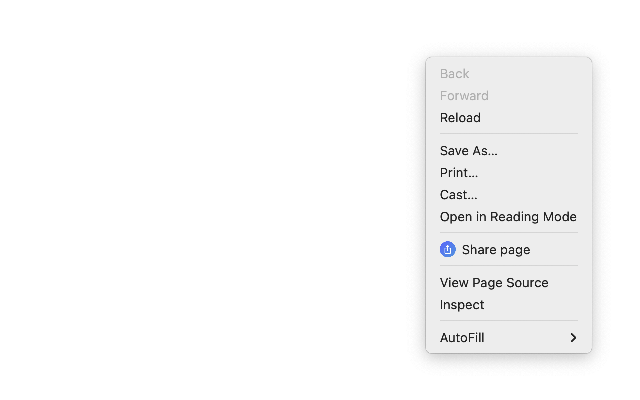

#  Quick Menu Share

Chrome extension to share anything from the context menu.

## Install

[link-chrome]: https://chrome.google.com/webstore/detail/quick-share/aimnjikkoakgjimladinlppcibjmkakg 'Version published on Chrome Web Store'

[][link-chrome] [][link-chrome] also compatible with [][link-chrome] [][link-chrome] [][link-chrome]
